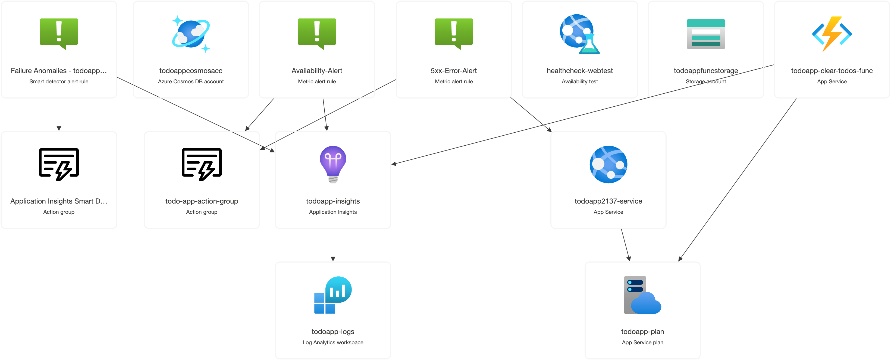

# 🦀 Todo App based on Azure infrastructure 🦀
## Building
Binary:
```bash
cargo build --release
```

Docker image:
```
docker buildx build -t todo_app:latest . --push your_docker_hub_account/todo_app:latest
```

## Setting up infrastructure
By default configuration uses image of the application which is stored in on my Docker Hub account.
If you want to use your own image, you need to build it and push it to your own Docker Hub account.
Then you need to change the `app_image_name` in `infra/variables.tf` file.
```bash
cd infra && terraform init && terraform apply
```

## Infrastructure description
Project is using Azure infrastructre. It consists of following resources:
# 📦 Azure Infrastructure Overview

This project leverages **Azure Cloud Infrastructure** for deploying and managing a Rust-based web application. The infrastructure is defined using **Terraform**.

---

## 🏗️ Provisioned Azure Resources

### 1. **Resource Group**
- Centralized grouping of all project resources.
- Simplifies resource management and monitoring.

### 2. **Azure Cosmos DB**
- NoSQL database with session consistency.
- Includes:
  - **SQL Database**: `todoappdb`
  - **Container**: `todos` (partitioned by `/created_by`)

### 3. **Log Analytics Workspace**
- Collects diagnostic logs and performance metrics.
- Integrated with **Application Insights** for unified monitoring.

### 4. **Application Insights**
- Monitors performance, logs, and errors.
- Connected to the **Log Analytics Workspace** for advanced insights.

### 5. **Linux App Service Plan**
- Hosts the application in a scalable Linux environment.
- SKU: **S1** (Standard tier).

### 6. **Azure Linux Web App**
- Runs the Dockerized Rust application.
- Features:
  - **System Assigned Identity** for secure access.
  - **Built-in Authentication** enabled.

### 7. **Azure App Function**
- Runs python script to cleanup old todos marked as done.
- Features:
  - **Scheduled Trigger**: Runs every 20 minutes.

### 8. **Monitoring and Alerting**

- **5xx Error Alert**: Triggers on **any server error** detected.
- **Availability Test**: Pings the `/healthcheck` endpoint every **5 minutes** from `"us-fl-mia-edge"`.

---

## 🚀 Deployment and Automation
- Uses **Terraform** for Infrastructure as Code (IaC).
- Supports automated builds and deployments via **Github Actions**.
- Fully scalable with Azure App Service Plan.

---

## 🔒 Security and Monitoring
- Service secured with **App Service built-in authentication**.
- Real-time monitoring with **Application Insights** and **Log Analytics**.
- Proactive error detection through **alert rules** and **health checks**.

---

## 📊 Resources visualization

